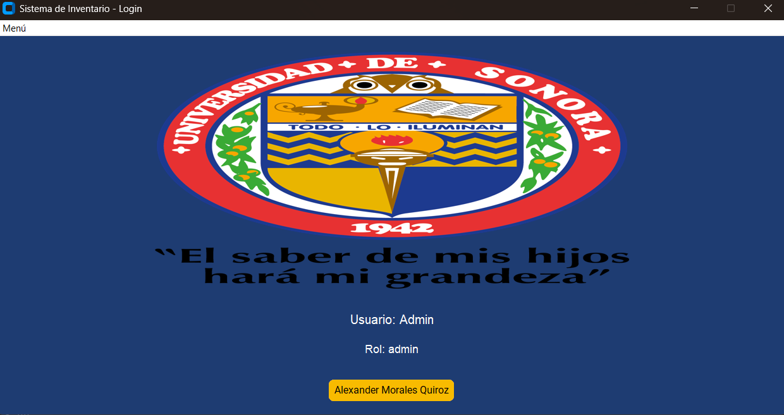
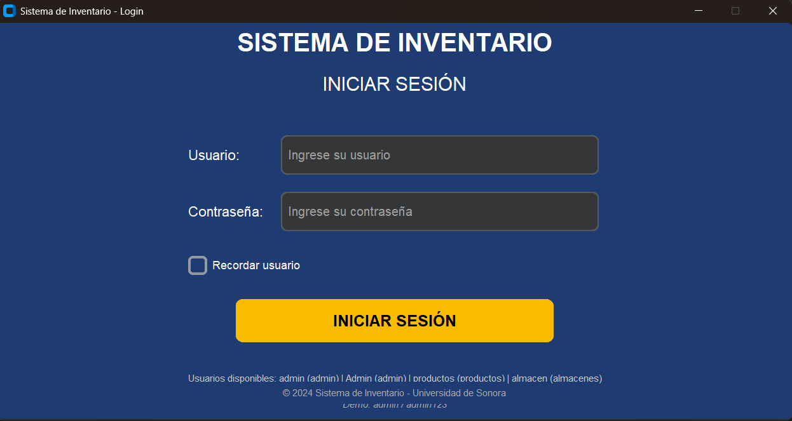

# Sistema de base de datos phyton
proyecto de Alexander Morales Quiroz como proyecto final de mi clase de base de datos

# contenido:
- [Descripción general](#descripcion-general)
- [Características principales](#caracteristicas-principales)
- [Arquitectura del proyecto](#arquitectura-del-proyecto)
- [Base de datos](#base-de-datos)
- [Roles Y autetificacion](#roles-y-autentificacion)
- [Interfaz](#interfaz)
- [Desafios/Soluciones](#Desafios/Soluciones)
- [Como ejecutar](#Como-ejecutar)
- [Capturas](#capturas)
- [Conclusion](#Conclusion)

# Descripcion:
este programa funciona como una interfaz grafica para un inventario usando phyton como lenguaje en respuesta a los problemas que se me dieron
el proyecto implemento las librerias de CustomTikner, Sqlite y phyton

# Caracteristicas:
- Capacidad de logear con diferetes credenciales para evitar problemas con las bases de datos con personas que no deberian estar ahi, crear,editar,eliminar o consultar datos en la base de datos de manera sencilla
- Filtros para buscar la informacion en la base de datos
- Diferentes usuarios (Admin, Productos, Almacen)
- Interfaz facil de entender

# Arquitectura del proyecto:
el sistema esta basado en diferentes clases 
- Main: funciona para abrir el programa y enciende directamente el login
- Login: es el que verifica los usuarios y contraseñas para las credenciales
- Menu principal: es el menu que conecta las dos tablas de la base de datos, no tiene funcionalidad extra
- Productos: funciona como interfaz grafica a la tabla de productos con el crud funcional
- Almacen: funciona como interfaz grafica a la tabla de almacen con el crud funcional

# Base de Datos:
- Usuarios: esta es la tabla que contiene los usuarios y sus contrañas
- Almacenes: contiene la id y el nombre del almacen
- Productos: contiene la id, nombre, precio, departamento, almacen

# Roles:
el programa tiene 3 usuarios anteriormente que son admin,productos, almacen
-Admin tiene los permisos para editar,agregar o eliminar de la tabla de productos y almacen
-Almacen: tiene los permisos para editar,agregar o eliminar de la tabla de almacen pero no productos
-Productos: tiene los permisos para editar, agregar o eliminar de la tabla de productos pero no de almacenes

# Interfaz:
la interfaz utiliza el framework de CTinker
ejemplo:

# Desafios/Soluciones:
- Programar en phyton: desafio: mi primer y mas grande problema fue aprender a programar (al menos lo necesario) en un nuevo lenguaje y a demás necesitar aprender a usar la librería que utlice y sus limitante. Solucion: ver cursos de programación en phyton, buscar formas de implementar la librerías y uso de la IA
- Todo en una sola ventana: desafio: como dije anteriormente el profe quiso específicamente que todo sea una ventana ya que según sus palabras así era mas difícil. Solucion: hacer que las diferentes clases sean frames, limpio la ventana y mando a llamar las diferentes clases
- Encriptacion de los datos: desafio: las contraseñas de los usuarios necesitaba estar encripatada. Solucion: se uso hash para encriptar las contraseñas

# Como ejecutar:
- instalar dependencias
- ejecutar el .exe y poco mas supongo.

# Capturas
- Login:
  
- pantalla de inicio:
  
- Productos:
  
